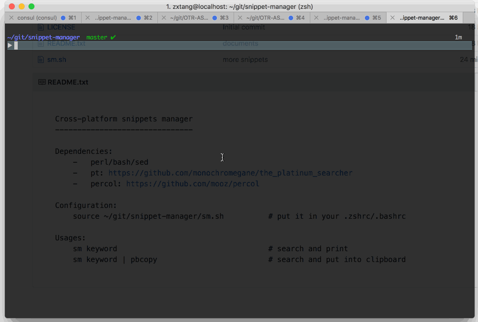

    Quick Try in Docker / 在 Docker 里试试
    --------------------------------------

        make
        q vector

    Quick Local Install / 快速本地安装
    ----------------------------------

        bash ./install.sh
        source ./sm.sh
        q vector

    Cross-platform snippets manager (a command-line tool)
    -----------------------------------------------------

    Dependencies:
        -   grepping tool: `pt`
                +   pt: https://github.com/monochromegane/the_platinum_searcher
                        go get a binary from github release page for your platform
        -   live filtering tool: `percol`
                +   percol: https://github.com/mooz/percol
                        pip install percol

    Configuration:
        source ~/git/snippet-manager/sm.sh          # put it into your .zshrc/.bashrc

    Usages:
        q keyword                                   # search and print
        cq keyword                                  # search and copy to clipboard,
                                                      uses pbcopy on macOS, xclip on Linux
        viq keyword                                 # update snippet (I personally use vim)

        q keyword -G java                           # search only java snippets
        nq                                          # create a snippet

    ---

    跨平台命令行代码片段管理工具
    -----------------------

    依赖项:
        -   perl/bash/sed (通常系统已自带)
        -   文件夹下文本搜索工具: pt
                +   pt: https://github.com/monochromegane/the_platinum_searcher
                        github 的 release 页面上可以下载二进制
        -   文本动态过滤工具: percol
                +   percol: https://github.com/mooz/percol
                        pip install percol

    安装配置:
        source ~/git/snippet-manager/sm.sh          # 放到你的 .zshrc 或 .bashrc 里

    使用方法:
        q keyword                                   # 搜索 keyword, 动态过滤, 并打印搜到的文件
        cq keyword                                  # 同上, 不打印而是放到剪切板
        viq keyword                                 # 不打印也不放到剪切板, 而是编辑 snippet

        q keyword -G java                           # 只搜索 java 后缀的文本, 更多使用请参考 pt 的文档
        nq                                          # 创建一个 snippet

示意图：（有点旧了，现在体验更好）

